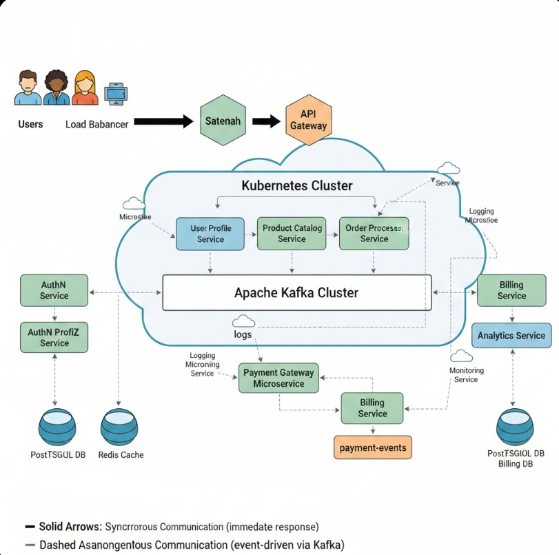

# Inventendo

**Inventendo** is a B2B SaaS platform designed to transform supply chain and logistics operations through centralized visibility, real-time analytics, and intelligent decision-making. We empower organizations to move from reactive operations to proactive, data-driven strategies.

## 🎯 Problem We Solve

Many organizations operate with fragmented systems and delayed reports, resulting in:
- **Reactive Operations**: Slow response to changing conditions
- **Missed Inefficiencies**: Hidden cost and performance leaks
- **Siloed Data**: Disconnected insights across departments

Inventendo changes this by centralizing operational data and providing real-time analytics through intuitive, role-based dashboards.

---

## ✨ Key Features

### 📊 Real-Time Dashboard Access
Each user receives a dedicated, role-based dashboard tailored to their responsibilities:
- **Operations Managers**: End-to-end visibility into logistics networks
- **Supply Chain Directors**: Strategic insights and trend analysis
- **Analytics Teams**: Deep-dive data exploration and custom reporting
- **Finance Teams**: Cost analysis and billing insights

### 🤖 AI-Powered Monitoring
Advanced anomaly detection and early warning systems that analyze:
- Historical operational patterns
- Live data streams
- Predictive risk indicators
- Proactive alerts before issues escalate

### 🔐 Enterprise-Grade Security
- **Role-Based Access Control (RBAC)**: Granular permission management
- **Multi-Tenant Architecture**: Secure data isolation between organizations
- **Secure Authentication**: Industry-standard authentication and authorization
- **Data Encryption**: End-to-end protection for sensitive information

### 💳 Subscription-Based SaaS
- Integrated payment gateways for flexible billing
- Scalable pricing tiers for businesses of all sizes
- Usage-based analytics and transparent cost tracking

---

## 🏗️ Architecture Overview

Inventendo is built on a **microservices architecture** designed for scalability, reliability, and fault isolation:

### Core Components

**API Layer:**
- **Load Balancer**: Distributes traffic across multiple instances
- **Statenah Gateway**: Unified entry point for all client requests
- **API Gateway**: Routes requests to appropriate microservices

**Microservices (Kubernetes Orchestrated):**
- **User Profile Service**: User management and authentication
- **Product Catalog Service**: Supply chain asset and inventory data
- **Order Processing Service**: Order management and fulfillment workflows
- **Analytics Service**: Real-time data processing and insights
- **Billing Service**: Subscription management and payment processing
- **Monitoring Service**: System health and anomaly detection

**Event-Driven Pipeline:**
- **Apache Kafka Cluster**: Asynchronous event processing for:
    - Analytics data pipelines
    - Billing workflows
    - Monitoring triggers
    - Audit logging
    - Reliable, decoupled communication between services

**Data Layer:**
- **PostgreSQL**: Transactional data (user profiles, orders, billing)
- **Redis Cache**: High-speed access to frequently requested metrics
- **Secondary Database**: Analytics and historical data storage

**Additional Services:**
- **AuthN Service**: Authentication and authorization
- **AuthN ProfileZ Service**: User profile and permission management
- **Payment Gateway Microservice**: Secure payment processing

---

## 🛠️ Technology Stack

**Frontend & Web:**
- Next.js - Modern React-based web framework

**Backend Services:**
- Spring Boot - Robust Java microservices framework

**Event Streaming & Processing:**
- Apache Kafka - Distributed event streaming platform

**Containerization & Orchestration:**
- Docker - Container packaging
- Kubernetes - Container orchestration and scaling

**Data & Caching:**
- PostgreSQL - Relational database
- Redis - In-memory caching layer

**Architecture Pattern:**
- Microservices - Scalable, loosely coupled services
- Event-Driven - Asynchronous, reliable data pipelines

**Advanced Features:**
- AI Monitoring - Machine learning-based anomaly detection
- Payment Gateway Integration - Subscription billing and payments

---

## 🚀 Getting Started

### For New Users

1. **Create Account**: Register with your organization's details
2. **Setup Dashboard**: Customize your dashboard based on your role
3. **Configure Access**: Invite team members and assign roles
4. **Start Monitoring**: Access real-time insights immediately

### User Roles & Dashboard Access

**Admin**
- Full platform access
- User and role management
- Organization settings
- Billing and subscription management

**Operations Manager**
- Real-time operational dashboards
- Order tracking and fulfillment monitoring
- Logistics network visibility
- Alert management

**Analytics Lead**
- Advanced reporting and custom queries
- Historical trend analysis
- Performance benchmarking
- Data export capabilities

**Supply Chain Director**
- Executive summary dashboards
- Strategic KPI tracking
- Supplier performance metrics
- Cost analysis and optimization recommendations

**Billing Administrator**
- Invoice management
- Subscription tracking
- Cost breakdown and forecasting
- Payment history

---

## 📈 Why Choose Inventendo?

✅ **Real-Time Insights**: Sub-second dashboard updates powered by Redis caching  
✅ **Scalability**: Kubernetes-orchestrated microservices grow with your needs  
✅ **Reliability**: Event-driven architecture ensures no data loss  
✅ **Intelligence**: AI-powered anomaly detection catches issues before they impact operations  
✅ **Security**: Enterprise-grade multi-tenant isolation and role-based access  
✅ **Flexibility**: Subscription model with transparent, usage-based pricing  
✅ **Integration**: Open APIs for seamless connection with existing systems

---

## 🔒 Security & Compliance

- **Data Isolation**: Complete multi-tenant data separation
- **Role-Based Access**: Granular permission controls per user
- **Audit Logging**: Complete audit trails via Apache Kafka
- **Encryption**: Data encrypted in transit and at rest
- **Monitoring**: Continuous system health and security monitoring

---

## 💬 Support & Documentation

For questions, feature requests, or technical support, please reach out to our team:

**Documentation**: Coming soon  
**Support**: [support@inventendo.com](mailto:support@inventendo.com)  
**Status Page**: [status.inventendo.com](https://status.inventendo.com)

---

## 📄 License

Proprietary - All rights reserved

---

**Ready to transform your supply chain operations?**  
[Get Started with Inventendo](https://inventendo.com/signup)

---

*Inventendo - Making Supply Chain Visibility Intelligent*
